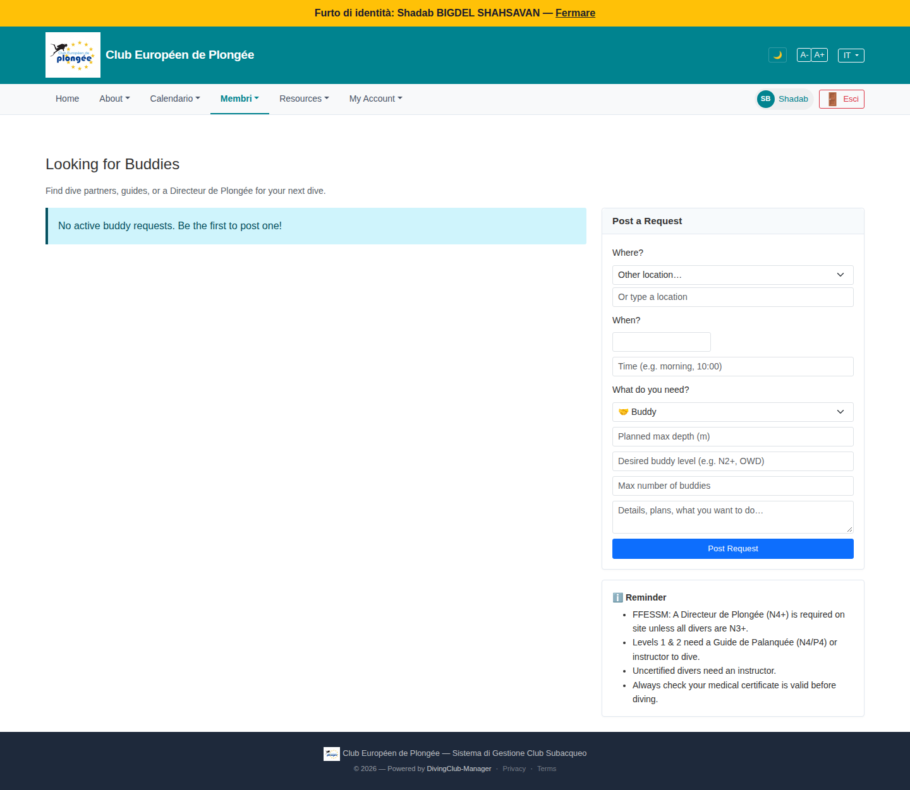

# 47 — Looking for Buddies (member view)

- **Screen** — `GET /buddies`, regular member, IT locale, no active requests.
- **Reads as** — "Looking for Buddies" + "Find dive partners, guides, or a Directeur de Plongée for your next dive.", a blue info box "No active buddy requests. Be the first to post one!", and a right-column "Post a Request" form: Where? (select + free text) / When? (date + time text) / What do you need? (Buddy select) / Planned max depth / Desired buddy level / Max number of buddies / Details textarea / "Post Request". Below it a "Reminder" card with 4 FFESSM safety rules.

## Friction

1. **Entirely English** on an IT-locale session — title, description, form labels, placeholders, the reminder card. Not localised at all.
2. **The form is always open on the right**, full height, even though the left side just says "nothing here yet". For a member who's browsing, not posting, the page is dominated by an 8-field form.
3. **8 fields to post a buddy request** — Where (2 controls), When (2 controls), type, depth, level, count, details. That's a lot for "anyone want to dive Saturday?". Many are optional-feeling but not marked.
4. **"Where?" has a select *and* a free-text "Or type a location"** stacked — the two-controls-for-one-value pattern flagged elsewhere (register nationality, event location).
5. **"When?" = a bare date input + a free-text "Time (e.g. morning, 10:00)"** — time as unvalidated text invites "afternoonish". Same split-control issue.
6. **The "Reminder" card is 4 dense safety rules** (Directeur de Plongée N4+, Guide de Palanquée, uncertified needs instructor, check your medical) — important, but as a permanent grey block under the form it's wall-of-text and competes with the form.
7. **Empty-state CTA** — "Be the first to post one!" but the form is already right there; the info box adds nothing.
8. **No sense of scope** — buddy requests for club sorties? external dives? holidays? The description mentions "guides" and "Directeur de Plongée" which implies formal dive organisation, blurring it with the events system.

## Restructure

- **Localise everything.**
- **Collapse the post form** behind the existing "Post a Request" affordance (make it a button that opens the form as a panel/modal). Default view = the list of open requests (or the empty state).
- **Trim the form to essentials**: Quand (date + a proper time select) · Où (one control — the select, with "autre" revealing a text field) · Type (buddy / guide / DP) · Détails (free text). Move depth / level / max-buddies into an "Options" disclosure.
- **One control per value** for Where and When.
- **Fold the safety reminder** into a single collapsible line ("Rappels sécurité ▾") or show it only inside the post form (where it's actionable), not on the browse view.
- **Real empty state** with one line of what buddies is for + the "Publier une demande" button; drop the redundant info box.

## Effort

S–M — localisation + collapsing the form + trimming fields + merging the split controls. The safety-reminder relocation is trivial.
