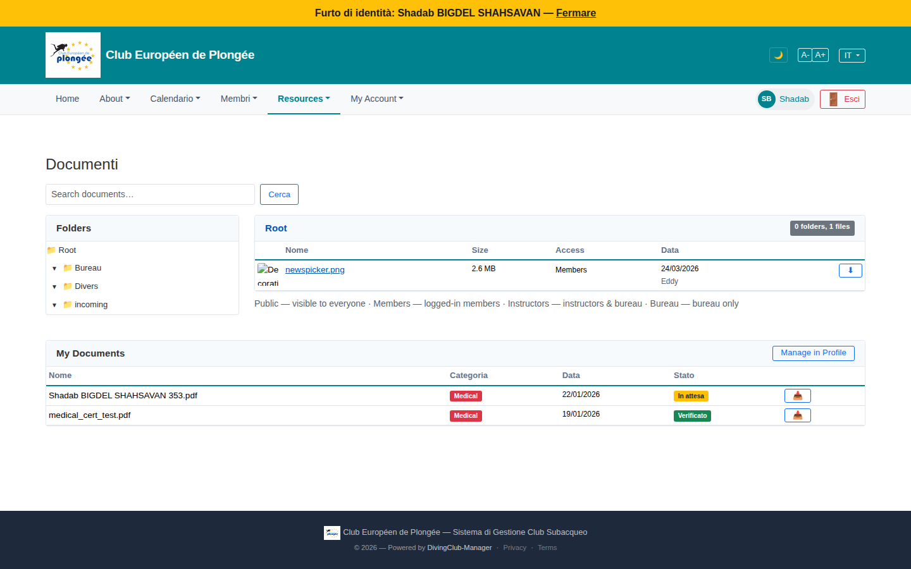

# 48 — Documents (member view)

- **Screen** — `GET /documents` (route `documents.index`), regular member, IT locale.
- **Reads as** — "Documenti" title, a search box, a "Folders" tree (Root → Bureau / Divers / incoming) + a right pane "Root" with "0 folders, 1 files" showing one file (`newspicker.png`, 2.6 MB, Access "Members", date + uploader). A legend line "Public — visible to everyone · Members — logged-in members · Instructors — … · Bureau — bureau only". Then a separate **"My Documents"** card: the member's own uploads (`Shadab … 353.pdf` Medical / In attesa, `medical_cert_test.pdf` Medical / Verificato) with a "Manage in Profile" button.

## Friction

1. **This is the admin Document Library (22) with fewer folders** — a member sees the same folder-tree + search + file-table UI. For a member, "browse the club's shared folders" is a rare need; the layout gives it the whole page.
2. **Language mix** — "Documenti" (IT); "Folders", "0 folders, 1 files", "Public — visible to everyone / Members — logged-in members / Instructors / Bureau", "My Documents", "Manage in Profile" (EN); "In attesa" (IT) / "Verificato" (IT) statuses; "Search documents…" (EN). Four+ languages.
3. **"0 folders, 1 files"** — ungrammatical ("1 files"), and a near-empty root that makes the shared-docs section look broken.
4. **The visibility legend is a run-on sentence** of 4 "Term — definition" pairs on one line — hard to parse, and mixing an em-dash list format flagged elsewhere.
5. **"My Documents" is the part a member actually cares about** (their medical cert status) and it's *below* the shared-folder browser, styled as a secondary card.
6. **"My Documents" and "Manage in Profile" overlap with the profile's "Certificat médical" tab** — the same documents are managed in two places with different UIs; "Manage in Profile" is an admission that this card is a read-only shadow of the real thing.
7. **Medical cert status ("In attesa" / "Verificato")** is important compliance info shown here in passing, with no explanation of what "in attesa" means for the member (can they dive? do they need to do something?).
8. **Folder icons but no counts**, same as the admin library.

## Restructure

- **Flip the priority for members.** Lead with **"Mes documents"**: medical certificate(s) with a clear status line ("Certificat médical : valide jusqu'au 22/01/2027 ✓" / "en attente de vérification par le bureau — aucune action requise" / "expiré — merci d'en téléverser un nouveau") and the upload control right there. Then, below, the shared folders.
- **One place to manage medical docs.** Either this card *is* the management UI (drop "Manage in Profile" and the separate profile tab), or this card links to it and shows status only — not two half-implementations.
- **Localise everything**; fix "1 files" → "1 fichier".
- **Simplify the shared-docs section** for members: drop the folder-path power-user input, show folder counts, and render the visibility legend as a small `?` popover, not an inline sentence.
- **Explain the statuses** inline (as above), since this is where a member learns whether they're cleared to dive.

## Effort

M — reordering the page + turning "My Documents" into the real medical-doc UI (or clearly delegating). Localisation + legend + "1 files" are S.
