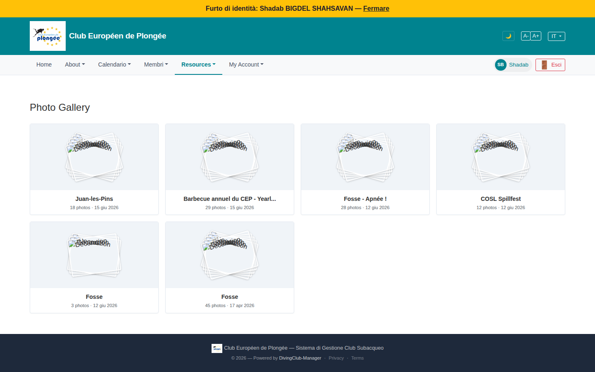

# 49 — Photo Gallery (member view)

- **Screen** — `GET /gallery`, regular member, IT locale.
- **Reads as** — "Photo Gallery" title, a 4-column grid of 6 album cards (Juan-les-Pins / Barbecue annuel du CEP / Fosse - Apnée ! / COSL Spillfest / Fosse / Fosse), each: a placeholder "stack of photos" graphic with broken overlaid text ("Information / Decoration" garbled), album name, "N photos · DD mmm YYYY".

## Friction

1. **Every album thumbnail is a broken placeholder.** The card image is a generic photo-stack SVG with two strings ("Information", "Decoration") rendered on top of each other, unreadable. No album shows an actual cover photo — so the gallery is a grid of identical grey rectangles. (Could be a staging asset issue, but the *design* relies on a cover image that isn't there.)
2. **Language mix** — "Photo Gallery", "N photos" (EN); dates localised to IT ("15 giu 2026", "17 apr 2026"); album names FR ("Barbecue annuel du CEP", "Fosse - Apnée !").
3. **"Fosse" appears three times** as separate albums (3 photos / 45 photos / 28 as "Fosse - Apnée !") with no disambiguation — same venue, different dates, but the card leads with the identical name and the date is small secondary text.
4. **No sort / filter / search** — 6 albums now, but this grows every event; no "by year", no "my events only", no search.
5. **Card metadata is thin** — name + count + date. No indication of which club event it belongs to (there's a `gallery/{event}` route, so albums *are* event-linked), no "X new since your last visit".
6. **"Barbecue annuel du CEP - Yearl..."** truncates mid-word with no tooltip.
7. **4-column fixed grid** with large cards for very little content per card.

## Restructure

- **Fix the cover image** — use the first photo of the album as the thumbnail (with a subtle "N" stack indicator), or a solid colour + album initial if truly empty. Never the broken placeholder.
- **Localise** title and "N photos".
- **Lead the card with date context** when names repeat: "Fosse — 17 avr 2026" as the card title, or group albums by event/season with sub-headers.
- **Add sort (date desc default) + a year filter + search** once there's more than a screenful.
- **Link each card to its event** (badge "· Sortie du 15/06") so the gallery ties back to the calendar.
- **Responsive grid** (`auto-fill, minmax(220px, 1fr)`) and truncate names with a title attribute.

## Effort

S–M — the cover-image fix is the main one (use album's first photo). Localisation, sort/filter, and date-forward titles are S.
