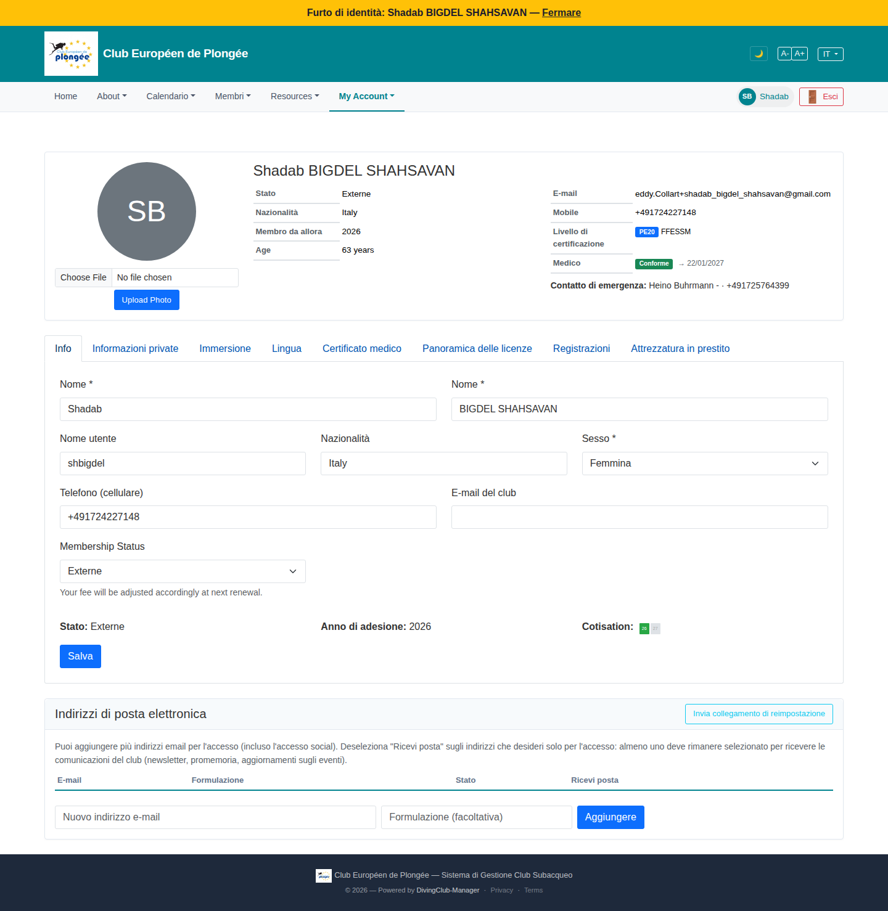

# 50 — Own profile (regular member)

- **Screen** — `GET /profile` as a regular member (Shadab, IT locale). Confirms the branch noted in review 31.
- **Reads as** — Same summary card + 8-tab layout as the admin member-edit view (11). The "Info" tab shows: Nome/Nome row, Nome utente/Nazionalità/Sesso row, Telefono/E-mail del club row, then a single "Membership Status" select with "Your fee will be adjusted…" helper, then — where the bureau sees editable fields — a **read-only strip**: "Stato: Externe · Anno di adesione: 2026 · Cotisation: [2 tiny chips]", then Salva. Then the "Indirizzi di posta elettronica" card.

## Friction

*(Everything structural in review 11 applies. Member-specific observations now that the actual member render is confirmed:)*

1. **Severe language mix.** "Informazioni private / Immersione / Lingua / Certificato medico / Panoramica delle licenze / Registrazioni / Attrezzatura in prestito" (IT tabs) but "Info" (EN/FR), "Membership Status" / "Your fee will be adjusted accordingly at next renewal." (EN), "Nome utente" / "Sesso" / "Nazionalità" (IT), "E-mail del club" (IT), "Cotisation:" (FR). Field labels flip language mid-form.
2. **The member still gets the full 8-tab dense form.** The only concession is that the "Bureau Master uniquement" fields render as a read-only text strip instead of inputs — so the member sees "Stato: Externe · Anno di adesione: 2026 · Cotisation: 🟩🟩" with no explanation of what any of it means or that it's bureau-managed.
3. **"Cotisation:" read-only chips** are 2 tiny unreadable green squares — even worse than the editable version (11), because now they're not even interactive, just decoration.
4. **"Membership Status" is an editable select for the member.** A member can change their own membership status ("Externe" → …) with only "Your fee will be adjusted accordingly at next renewal." as a guard. That's a consequential, bureau-territory field left editable and unexplained.
5. **"E-mail del club" is an empty editable field** for the member with no hint of what it's for — and the "Indirizzi di posta elettronica" card below is the real email-management UI.
6. **"Nome" / "Nome" for first name / last name** — the IT label for both is identically "Nome", so the two name fields are indistinguishable by label (should be "Nome" / "Cognome").
7. **Summary card photo upload** ("Choose File / Upload Photo") in the prime slot — same as 11.
8. **No self-service framing** — titled "Shadab BIGDEL SHAHSAVAN" with an admin-style summary card; nothing says "Il tuo profilo".

## Restructure

- **Deliver the trimmed member profile from review 31**: 2–3 tabs (Coordonnées / Plongée & médical / Connexion), self-service framing, classification fields **read-only with a plain-language line** ("Statut : Externe — géré par le bureau. Votre cotisation est calculée en conséquence.").
- **Make "Membership Status" read-only for members** (or, if self-selection is intended, explain the consequence properly and confirm on change).
- **Fix the localisation** — every label, helper, and tab; "Cognome" for last name; drop the FR "Cotisation:" fragment.
- **Cotisation years**: if shown to members at all, render as readable year labels ("Cotisations à jour : 2025, 2026"), not chips.
- Apply 11's fixes (photo out of summary card, standard country control, field widths).

## Effort

M–L — same as 31; this screenshot just confirms the member branch exists but is under-built. Localisation is the urgent, mostly-mechanical part.
