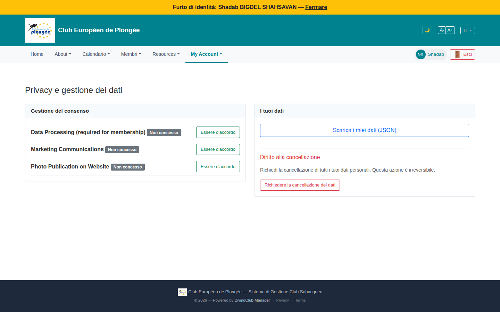

# 51 — Privacy & data management (member view)

- **Screen** — `GET /privacy` (route `gdpr.consents`), regular member, IT locale.
- **Reads as** — "Privacy e gestione dei dati" title, two cards. **Left "Gestione del consenso":** 3 rows — "Data Processing (required for membership)" / "Marketing Communications" / "Photo Publication on Website", each with a grey "Non concesso" badge and an "Essere d'accordo" button. **Right "I tuoi dati":** "Scarica i miei dati (JSON)" button, a hairline, "Diritto alla cancellazione" + explanatory line + "Richiedere la cancellazione dei dati" button.

## Friction

1. **Language mix on a legally-sensitive page.** IT: "Privacy e gestione dei dati", "Gestione del consenso", "Non concesso", "Essere d'accordo", "I tuoi dati", "Scarica i miei dati", "Diritto alla cancellazione". EN: the three consent names — "Data Processing (required for membership)", "Marketing Communications", "Photo Publication on Website". The actual consent items — the things with legal weight — are the untranslated ones.
2. **"Essere d'accordo" is a poor button label.** Machine-ish IT for "Agree"; and it's a one-way action — there's a button to *grant* consent but no visible way to *withdraw* it (GDPR requires withdrawal to be as easy as granting). A toggle is the right control.
3. **"Data Processing (required for membership)" shows "Non concesso" with an "Essere d'accordo" button** — implying a current member hasn't agreed to the processing their membership requires. Either the state is wrong, or this required consent shouldn't be presented as an optional grant here.
4. **"Non concesso" grey badge** looks like a disabled/neutral state, not "you have withheld this". No positive "Concesso ✓" state shown for comparison, so the user can't tell if grey = off or grey = unset.
5. **Consent rows have no dates / no history** — GDPR-wise, "when did I consent / withdraw" matters. No "accordé le …" line.
6. **"Scarica i miei dati (JSON)"** — JSON is developer-facing; a member expects a readable export (PDF/CSV) or at least a note on what the file contains.
7. **"Richiedere la cancellazione dei dati"** button is styled like a normal outline button despite being irreversible (the helper says "Questa azione è irreversibile") — should be visually distinct (danger) and require a confirm step.
8. **Two cards, unequal height**, right card much shorter — the layout leaves a big empty area bottom-right.

## Restructure

- **Localise the consent item names** (and everything else) — these especially must be in the member's language.
- **Consent as toggles**, each showing current state ("Accordé le 12/03/2026" / "Non accordé"), with granting and withdrawing equally easy. Separate "required for membership" processing into its own read-only "Base légale : exécution du contrat d'adhésion" note — not a toggle that can sit at "Non concesso".
- **Show consent history** (granted/withdrawn timestamps) or at least the current-state date.
- **Relabel the export** ("Télécharger mes données") and add one line on format + contents; offer a human-readable option if feasible.
- **Erasure as a danger action** — red button, a confirm dialog explaining what happens (account closed, data anonymised, timeline), matching the "irreversible" copy.
- **Balance the columns** or stack them; put a short "Vos droits (RGPD)" explainer in the empty space.

## Effort

M — localisation of consent strings is mandatory and S. Converting grants to proper toggles + withdrawal + state dates is M. Danger-styling + confirm on erasure is S.
