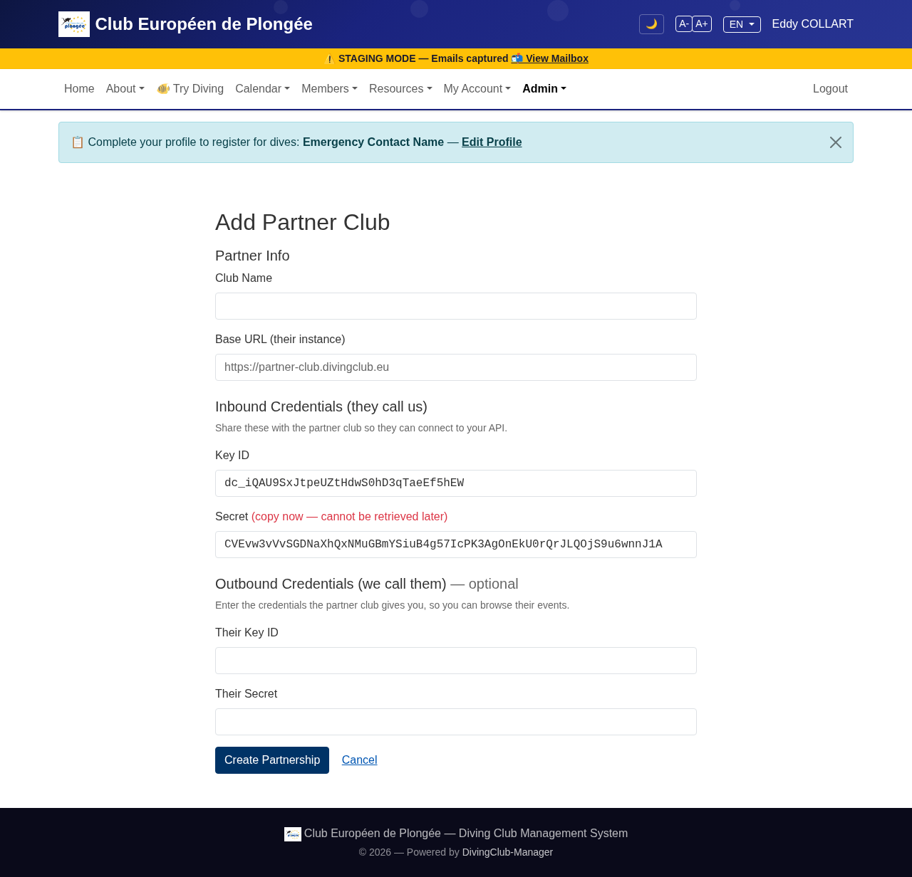
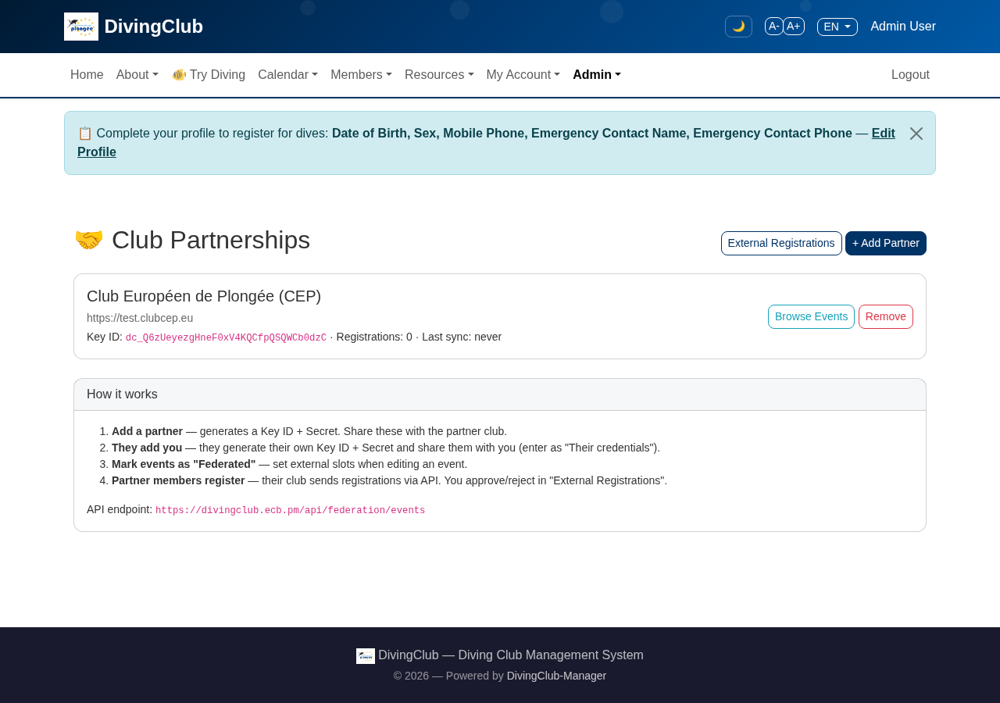
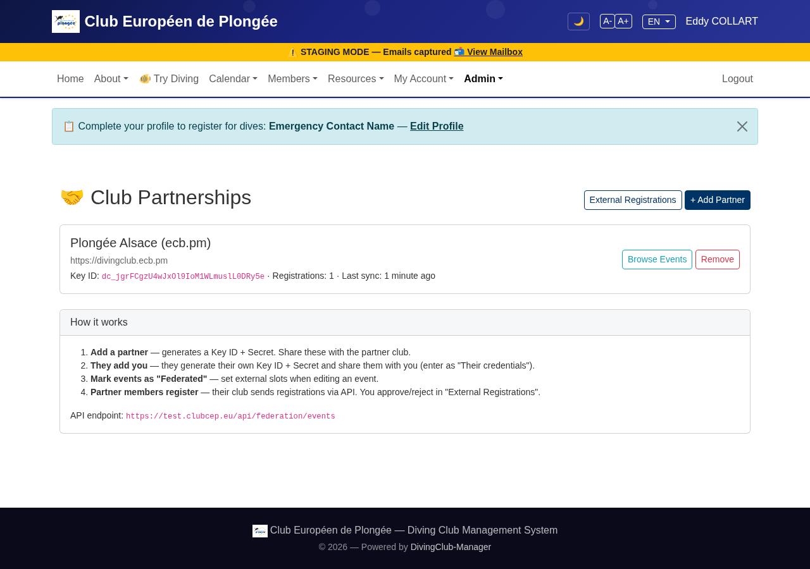
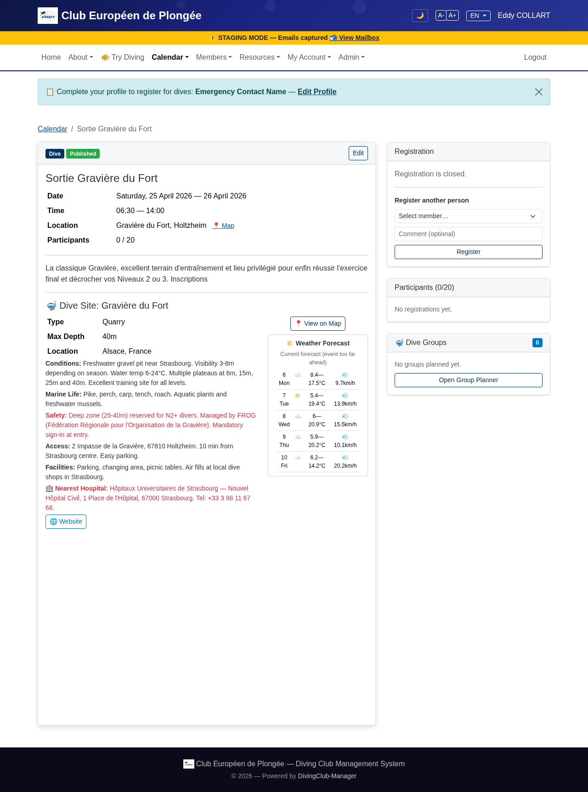
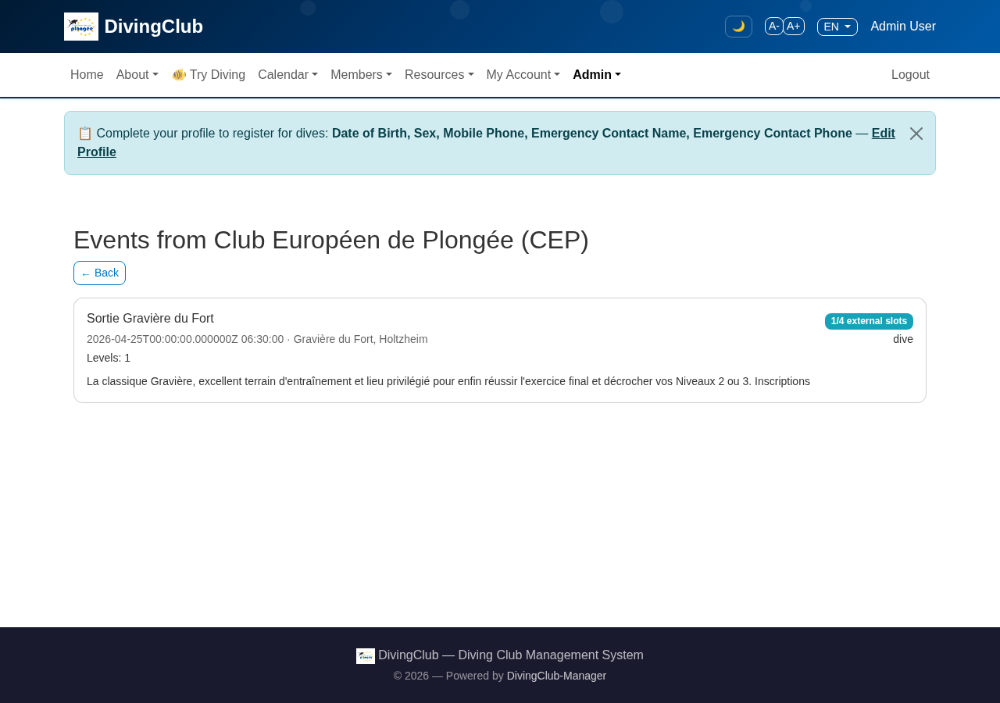
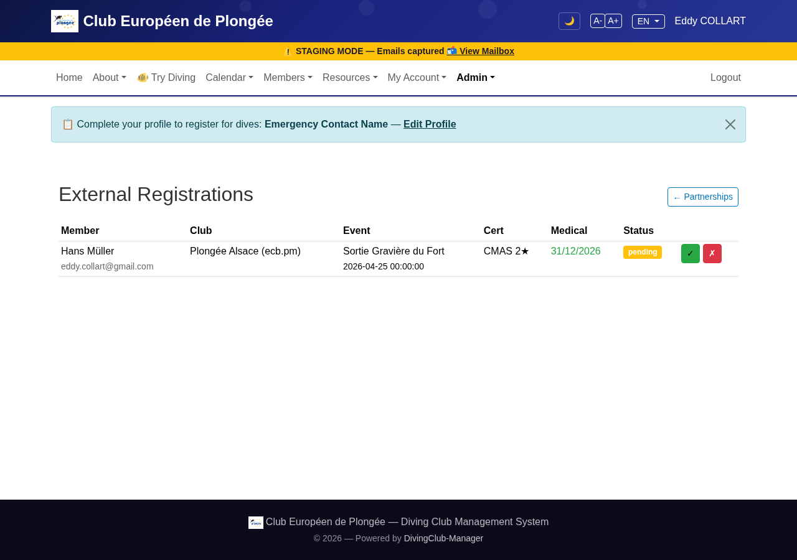
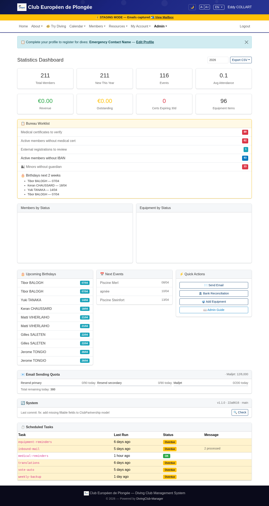

# 🤝 Guide de Partenariat Inter-Clubs

Deux instances DivingClub-Manager peuvent établir une relation de confiance, permettant aux membres d'un club de s'inscrire aux événements de l'autre. Ce guide détaille la procédure complète à partir de deux instances réelles :

- **Club A** : Club Européen de Plongée (CEP) — `test.clubcep.eu`
- **Club B** : Plongée Alsace — `divingclub.ecb.pm`

---

## Principe de fonctionnement

Chaque club génère des identifiants API (Key ID + Secret). Ils échangent ces identifiants pour que chaque côté puisse authentifier les appels API de l'autre. Une fois appairés :

1. Chaque club peut **consulter les événements fédérés** de l'autre
2. Un club partenaire peut **inscrire ses membres** aux événements disposant de places externes
3. Le club organisateur **approuve ou refuse** les inscriptions externes
4. Le membre partenaire reçoit une **notification par email** de la décision

```
Club A                              Club B
  │                                   │
  │  1. Génère Key ID + Secret        │
  │  2. Partage avec Club B           │
  │                                   │
  │      Club B génère ses propres    │
  │      Key ID + Secret, les renvoie │
  │                                   │
  │  3. Marque un événement "Fédéré"  │
  │     Définit places_externes = 4   │
  │                                   │
  │  ◄── 4. GET /api/federation/events│
  │  ──► Retourne la liste            │
  │                                   │
  │  ◄── 5. POST /api/federation/     │
  │         register (infos membre)   │
  │  ──► Retourne registration_id     │
  │                                   │
  │  6. L'admin approuve/refuse       │
  │  ──► Email envoyé au membre       │
```

---

## Étape 1 — Créer le partenariat (Club A)

Aller dans **Admin → Partenariats → + Ajouter un partenaire**.

Le système génère automatiquement un Key ID et un Secret. Remplir :
- **Nom du club** : le nom du club partenaire
- **URL de base** : l'URL de leur instance DivingClub-Manager



> ⚠️ **Copiez le Secret maintenant** — il ne pourra plus être récupéré ensuite. Partagez le Key ID et le Secret avec le club partenaire via un canal sécurisé.

---

## Étape 2 — Créer le partenariat (Club B)

Le club partenaire fait la même chose : **Admin → Partenariats → + Ajouter un partenaire**.

Il génère ses propres Key ID + Secret et les renvoie au Club A.



---

## Étape 3 — Échanger les identifiants

Chaque club saisit les identifiants de l'autre dans la section **« Identifiants sortants »** :
- **Leur Key ID** : le Key ID que le partenaire vous a communiqué
- **Leur Secret** : le Secret que le partenaire vous a communiqué

Cela active le bouton « Voir les événements ».

Une fois l'échange effectué des deux côtés, la liste des partenariats affiche le partenaire avec un bouton « Voir les événements » et le nombre d'inscriptions :



---

## Étape 4 — Marquer des événements comme fédérés

Lors de la création ou modification d'un événement, le club organisateur définit :
- **Fédéré** : Oui
- **Places externes** : nombre de places réservées aux clubs partenaires (ex. 4)

L'événement apparaît alors dans l'API de fédération et affiche les détails du site de plongée, la météo et le panneau d'inscription :



---

## Étape 5 — Consulter les événements du partenaire

Cliquer sur **« Voir les événements »** dans la page des partenariats pour voir les événements fédérés du partenaire. Chaque événement affiche :
- Titre, date, lieu, description
- Badge **places externes** (ex. « 1/4 external slots »)
- Type d'événement



---

## Étape 6 — Inscrire un membre

Le club partenaire inscrit un membre via l'API :

```
POST /api/federation/register
En-têtes :
  X-Club-Key-Id: dc_xxx
  X-Club-Secret: yyy

Corps :
{
  "event_id": 704,
  "member_name": "Hans Müller",
  "member_email": "hans@example.com",
  "cert_level": "CMAS 2★",
  "medical_valid_until": "2026-12-31",
  "notes": "Possède son propre matériel"
}
```

Réponse : `{"registration_id": 1, "status": "pending"}`

---

## Étape 7 — Approuver ou refuser

Le club organisateur voit l'inscription dans **Admin → Partenariats → Inscriptions externes** :



Le tableau affiche :
- Nom et email du membre
- Nom du club partenaire
- Nom et date de l'événement
- Niveau de certification
- Validité du certificat médical
- Statut (en attente) avec boutons ✓ approuver / ✗ refuser

La **liste de tâches du bureau** sur le tableau de bord affiche également « Inscriptions externes à examiner : 1 » :



Lors de l'approbation ou du refus, un email est automatiquement envoyé au membre externe.

---

## Référence API

Tous les endpoints nécessitent une authentification via les en-têtes :
- `X-Club-Key-Id` : le Key ID partagé par le club organisateur
- `X-Club-Secret` : le Secret partagé par le club organisateur

| Méthode | Endpoint | Description |
|---------|----------|-------------|
| `GET` | `/api/federation/events` | Lister les événements fédérés avec places disponibles |
| `POST` | `/api/federation/register` | Inscrire un membre externe |
| `GET` | `/api/federation/register/{id}` | Vérifier le statut d'une inscription |
| `DELETE` | `/api/federation/register/{id}` | Annuler une inscription |

Limite : 30 requêtes par minute par partenaire.

---

## Sécurité

- Les secrets sont **hachés** (bcrypt) — jamais stockés en clair
- Les secrets sortants sont **chiffrés** (AES-256) au repos
- Chaque partenariat peut être **désactivé** ou **supprimé** instantanément
- L'API est **limitée en débit** (30 req/min)
- Seuls les événements explicitement marqués comme **fédérés** sont visibles
- Les inscriptions externes nécessitent une **approbation manuelle**

---

*Ce guide a été généré à partir d'un test réel entre test.clubcep.eu et divingclub.ecb.pm le 6 avril 2026.*
