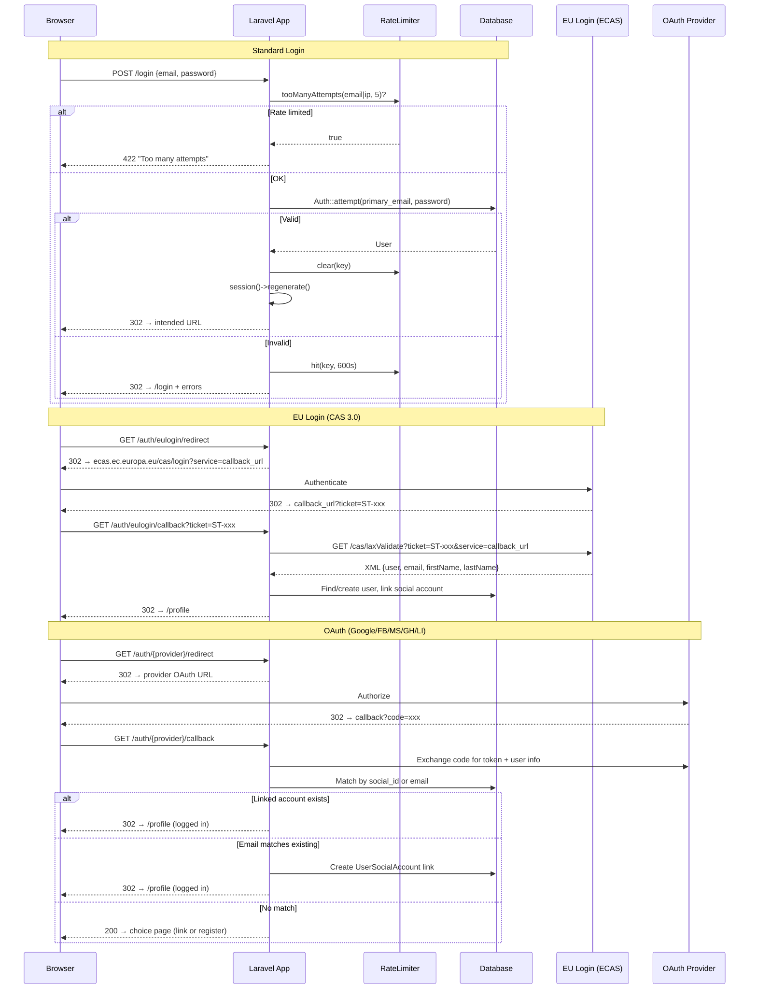
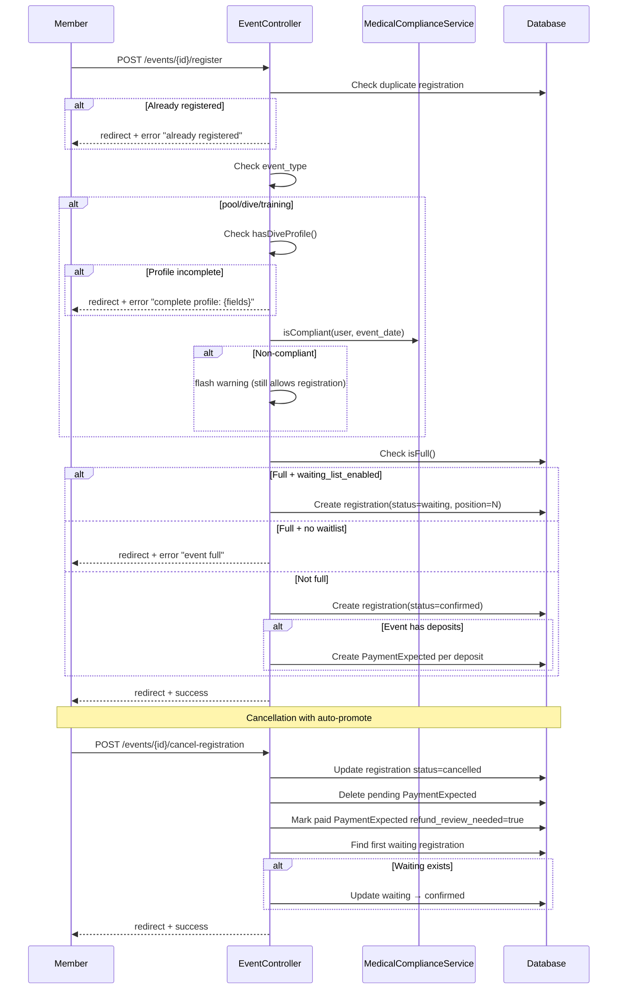
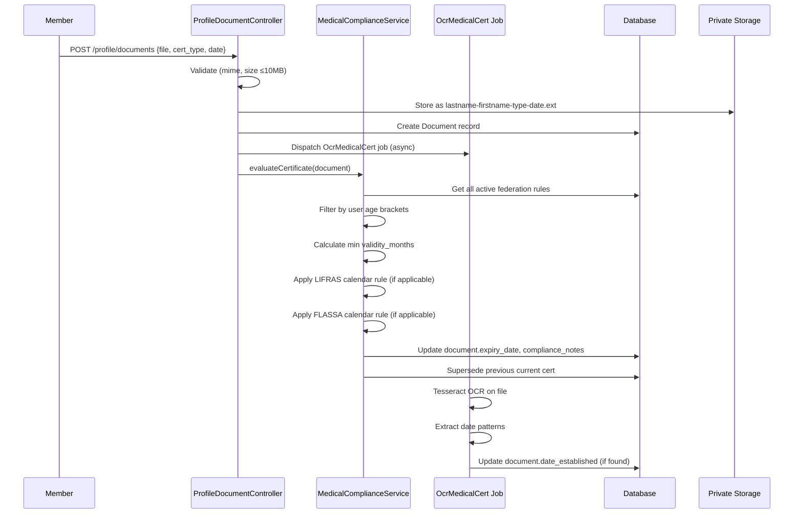
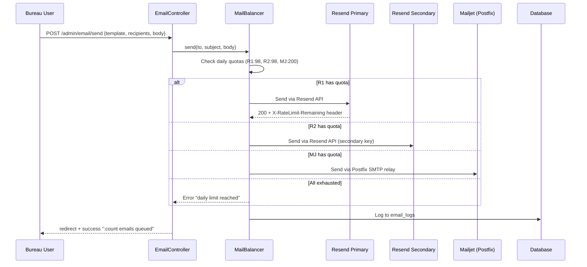
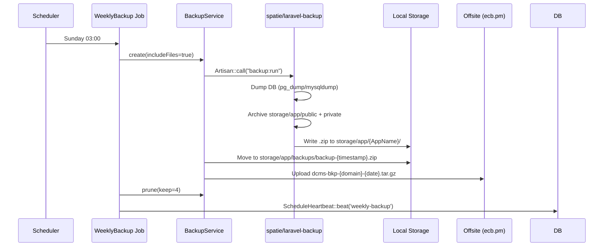
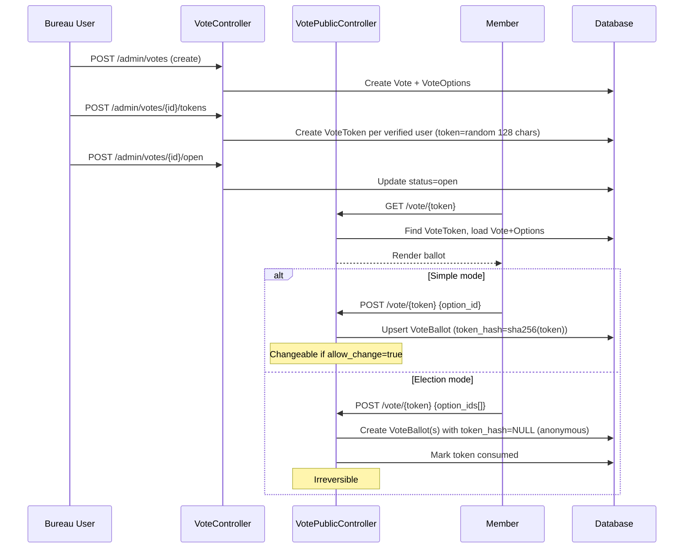

# DivingClub-Manager — Reverse-Engineered Design

Generated: 2026-04-15 from codebase analysis.

---

## 1. Primary Data Flows

### 1.1 Authentication Flow



### 1.2 Event Registration Flow



### 1.3 Medical Certificate Upload Flow



### 1.4 Email Send Flow



### 1.5 Backup Flow



### 1.6 Vote Flow



---

## 2. Type Definitions — Major Data Structures

### 2.1 User (core identity)
```
User {
    id: int (PK)
    username: string|null
    primary_email: string (unique)
    password: string|null (bcrypt)
    role_id: int (FK → roles)
    status_id: int (FK → member_statuses)
    preferred_locale: string|null
    email_verified_at: datetime|null
    cotisation_years: json|null  // ["2025","2026"]
    remember_token: string|null
    created_at, updated_at: datetime
    deleted_at: datetime|null (soft delete)
}
```

### 2.2 MemberDetail (46 fields)
```
MemberDetail {
    id: int (PK)
    user_id: int (FK → users, unique)
    first_name, last_name, birth_name: string|null
    sex: enum('M','F')|null
    date_of_birth: date|null
    place_of_birth, nationality: string|null
    phone_private, phone_office, phone_mobile: string|null
    address_line1, address_line2, city, postal_code, country: string|null
    emergency_contact_name, emergency_contact_phone, emergency_contact_relation: string|null
    blood_type: string|null
    allergies, medical_conditions: text|null
    avatar_path: string|null
    bcd_size, wetsuit_size, shoe_size, glove_size: string|null
    instructor_bio, instructor_specialties, instructor_motivation: text|null
    preferred_locale: string|null
    // + 15 more fields
}
```

### 2.3 Event (34 fields)
```
Event {
    id: int (PK)
    title: string
    color_hex: string|null
    event_type: enum('pool','dive','training','theory','social')
    event_date: date
    event_time, end_time: time|null
    end_date: date|null
    location: string|null
    description: text|null
    responsible_id, instructor_id: int|null (FK → users)
    assistant_ids: json|null
    max_participants: int|null
    waiting_list_enabled: bool (default false)
    inscription_open_at: datetime|null
    inscriptions_closed: bool (default false)
    estimated_cost: decimal|null
    deposit_1_date, deposit_2_date, deposit_3_date: date|null
    deposit_1_amount, deposit_2_amount, deposit_3_amount: decimal|null
    created_by: int (FK → users)
    status: enum('scheduled','cancelled','completed')
    is_federated: bool (default false)
    external_slots: int|null
    season_id: int|null (FK → seasons)
    dive_site_id: int|null (FK → dive_sites)
    whatsapp_group_url, participant_email: string|null
}
```

### 2.4 Document (20 fields)
```
Document {
    id: int (PK)
    user_id: int (FK → users)
    category: enum('medical','insurance','id','other')
    cert_type: string|null
    file_path: string
    original_filename: string
    mime_type: string
    size_bytes: int
    date_established: date|null
    expiry_date: date|null
    is_verified: bool (default false)
    verified_by: int|null (FK → users)
    verified_at: datetime|null
    superseded_by: int|null (FK → documents)
    is_current: bool (default true)
    is_compliant: bool|null
    compliance_notes: text|null
    reminder_30_sent_at, reminder_15_sent_at, reminder_7_sent_at, reminder_0_sent_at: datetime|null
    deleted_at: datetime|null (soft delete)
}
```

### 2.5 Equipment (23 fields)
```
Equipment {
    id: int (PK)
    club_id: string|null
    name, short_number: string
    brand, manufacturer: string|null
    type: string  // bcd, regulator, tank, wetsuit, fins, mask, computer, light, other
    serial_number: string|null
    purchase_date: date|null
    condition: string|null
    status: enum('available','on_loan','maintenance_required','retired')
    is_loanable: bool (default true)
    notes: text|null
    location: string|null
    // Tank-specific:
    threading, material: string|null
    manufacture_date: date|null
    weight_kg, volume: decimal|null
    test_pressure_bar, working_pressure_bar: decimal|null
    last_retest_date, next_retest_date, last_inventory_date: date|null
}
```

### 2.6 Federation API Contract
```
GET /api/federation/events
  Auth: X-Api-Key header (ClubPartnership.their_api_key_id)
  Response: [{id, title, event_date, event_type, location, max_participants, external_slots, registered_count}]

POST /api/federation/register
  Auth: X-Api-Key header
  Body: {event_id, first_name, last_name, email, federation, certification_level}
  Response: {id, status: "confirmed"|"waiting"}

GET /api/federation/register/{id}
  Response: {id, event_id, first_name, last_name, status}

DELETE /api/federation/register/{id}
  Response: 204
```

### 2.7 Instance Status API
```
GET /api/instance/status
  Auth: none
  Response: {name, version, members_count, events_count, uptime}
```

---

## 3. Physical File Structure → Component Map

```
app/
├── Http/
│   ├── Controllers/
│   │   ├── Admin/           # 26 controllers — bureau-only CRUD
│   │   │   ├── DashboardController      → REQ-BAK-005 (worklist, stats)
│   │   │   ├── MemberController         → REQ-MEM-001..005, REQ-AUTH-005
│   │   │   ├── PaymentController        → REQ-PAY-001..004
│   │   │   ├── EquipmentController      → REQ-EQP-001..003
│   │   │   ├── NewsletterController     → REQ-MAIL-005
│   │   │   ├── VoteController           → REQ-VOTE-001..003
│   │   │   ├── SeasonController         → REQ-EVT-007
│   │   │   ├── BackupController         → REQ-BAK-001..002
│   │   │   ├── SettingsController       → REQ-THM-001, REQ-MEM-002
│   │   │   ├── RolePermissionController → REQ-AUTH-006
│   │   │   ├── EmailController          → REQ-MAIL-002
│   │   │   ├── EmailStatsController     → REQ-MAIL-003
│   │   │   ├── ArticleController        → REQ-CMS-001
│   │   │   ├── LibraryController        → REQ-DOC-001
│   │   │   ├── DiveSiteController       → REQ-SITE-001
│   │   │   ├── GuardianController       → REQ-MEM-009
│   │   │   ├── PartnershipController    → REQ-PART-001..002
│   │   │   ├── TrialRequestController   → REQ-TRIAL-001 (admin view)
│   │   │   ├── AuditLogController       → REQ-BAK-004
│   │   │   ├── AnnualReportController   → (annual stats export)
│   │   │   ├── AuditorController        → (read-only finance for auditors)
│   │   │   ├── DiveGroupRuleController  → REQ-EVT-009
│   │   │   ├── GuideController          → (in-app admin guide)
│   │   │   ├── LinkController           → (quick links management)
│   │   │   ├── MedicalExportController  → (CSV export for federations)
│   │   │   └── ThumbnailController      → (image thumbnail generation)
│   │   ├── Auth/            # 4 controllers
│   │   │   ├── LoginController          → REQ-AUTH-002
│   │   │   ├── RegisterController       → REQ-AUTH-001
│   │   │   ├── SocialAuthController     → REQ-AUTH-003
│   │   │   └── EuLoginController        → REQ-AUTH-004
│   │   ├── Api/             # 1 controller
│   │   │   └── FederationApiController  → REQ-PART-001
│   │   ├── EventController              → REQ-EVT-001..006
│   │   ├── DiveGroupController          → REQ-EVT-009
│   │   ├── InstructorAvailabilityController → REQ-EVT-010
│   │   ├── ProfileController            → REQ-MEM-001
│   │   ├── ProfileDocumentController    → REQ-MEM-005..007
│   │   ├── ProfileCertificationController → REQ-MEM-004
│   │   ├── ProfileAvatarController      → (avatar upload/crop)
│   │   ├── ProfileEmailController       → (secondary email management)
│   │   ├── GdprController              → REQ-MEM-008
│   │   ├── HomeController              → REQ-HOME-001..003
│   │   ├── HomepageLayoutController    → REQ-HOME-001 (widget drag-drop)
│   │   ├── VotePublicController        → REQ-VOTE-001..002
│   │   ├── ClassifiedController        → REQ-CMS-003
│   │   ├── CommentController           → REQ-CMS-004
│   │   ├── DocumentBrowserController   → REQ-DOC-002
│   │   ├── BuddyController            → REQ-BUD-001
│   │   ├── DuesCalculatorController    → REQ-PAY-001 (public calculator)
│   │   ├── CalendarFeedController      → REQ-CAL-001
│   │   ├── ContactController           → REQ-CONTACT-001
│   │   ├── ContactMemberController     → REQ-CONTACT-002
│   │   ├── QrCodeController            → REQ-PAY-003
│   │   ├── TrialController             → REQ-TRIAL-001
│   │   ├── MembersDirectoryController  → (member directory + trombinoscope)
│   │   ├── DiveDataController          → (UDDF export)
│   │   ├── PushSubscriptionController  → REQ-HOME-004
│   │   ├── InstallController           → (first-run setup wizard)
│   │   └── StagingMailController       → REQ-STG-002
│   ├── Middleware/          # 7 middleware
│   │   ├── CheckLicense     → REQ-BAK-003
│   │   ├── CheckRole        → REQ-AUTH-006
│   │   ├── EnsureEmailVerified → REQ-AUTH-007
│   │   ├── EnsureInstalled  → (redirect to /install if not set up)
│   │   ├── ParseEuropeanDates → (DD/MM/YYYY → Y-m-d conversion)
│   │   ├── SetLocale        → REQ-I18N-001
│   │   └── StagingBasicAuth → REQ-STG-001
│   └── Requests/           # 21 form request classes (all validation)
├── Models/                  # 56 Eloquent models, 118 relationships
├── Services/                # 22 services
│   ├── MedicalComplianceService    → REQ-MEM-006
│   ├── FeeCalculationService       → REQ-PAY-001
│   ├── BankReconciliationService   → REQ-PAY-002
│   ├── MailBalancer                → REQ-MAIL-001
│   ├── EmailStatsService           → REQ-MAIL-003
│   ├── InboundMailFilter           → REQ-MAIL-004
│   ├── NewsletterStencilSlicer     → REQ-MAIL-005
│   ├── BackupService               → REQ-BAK-001..002
│   ├── LicenseService              → REQ-BAK-003
│   ├── ThemeService                → REQ-THM-001
│   ├── ArticleTranslationService   → REQ-CMS-002
│   ├── DiveGroupProposalService    → REQ-EVT-009
│   ├── SwapSuggestionService       → REQ-EVT-009
│   ├── ImageQualityService         → REQ-EVT-008
│   ├── FaceDetectionService        → REQ-EVT-008
│   ├── PushNotificationService     → REQ-HOME-004
│   ├── UddfService                 → (UDDF dive log export)
│   ├── DanExportService            → (DAN insurance export)
│   ├── SocialPublishService        → (social media auto-publish)
│   ├── MailAliasService            → (email alias management)
│   ├── UpdateService               → (git pull + migrate from admin)
│   └── ScheduleHeartbeat           → REQ-BAK-005
├── Jobs/                    # 9 queued/scheduled jobs
│   ├── SendMedicalReminders        → daily 08:00
│   ├── WeeklyBackup                → Sunday 03:00
│   ├── ProcessTranslations         → hourly
│   ├── AutoOpenCloseVotes          → every minute
│   ├── PollInboundMail             → every minute
│   ├── PurgeAuditLogs              → monthly 1st 04:00
│   ├── CleanupClassifieds          → monthly 1st 05:00
│   ├── SendEquipmentReminders      → daily 09:00
│   └── OcrMedicalCert              → dispatched on upload
├── Helpers/
│   ├── HtmlSanitizer               → XSS prevention (HTMLPurifier)
│   └── IconHelper                  → Emoji icon directive
├── Traits/
│   └── Auditable                   → REQ-BAK-004
config/
├── app.php          → staging_mode, staging credentials
├── backup.php       → spatie/laravel-backup + offsite SFTP config
├── club.php         → CLUB_ID, CLUB_IBAN, CLUB_DOMAIN, FEDERATION_SALT
├── cotisation.php   → fee structure per status
├── languages.php    → 15 locale definitions
├── permission.php   → Spatie permission config
├── webpush.php      → VAPID keys for push notifications
database/
├── migrations/      → 66 migration files
├── seeders/         → DatabaseSeeder, CertificationLevelSeeder, FederationSeeder,
│                      MemberStatusSeeder, CepSeeder, DemoDataSeeder,
│                      JoomlaMemberImportSeeder, setup_permissions.php
resources/
├── views/           → 133+ Blade templates
│   ├── components/  → layout, admin-layout, admin-sidebar, form-enhancements,
│   │                  instant-search, photo-gallery, rich-editor, slideshow, auth-validation
│   ├── admin/       → 43 admin templates (all use admin-layout with sidebar)
│   ├── profile/     → show + 7 tab partials (info, private, diving, medical, registrations, renewal, documents)
│   ├── events/      → index, show, form, dive-groups, _participant_row
│   ├── auth/        → login, register, forgot-password, reset-password, verify-email
│   ├── errors/      → 403, 404, 419, 429, 500, 503 (AI-generated underwater animals)
│   ├── home*.blade  → home (widgets), home2 (dark), home3 (visual), home4 (tiles)
│   └── ...          → cms, vote, gdpr, classifieds, buddies, documents, etc.
├── scss/app.scss    → Bootstrap 5 + custom theme (CSS variables, dark mode, admin sidebar)
├── js/app.js        → Bootstrap JS + Chart.js via Vite
lang/                → 15 locale directories + vendor/backup translations
public/
├── sw.js            → Service worker (offline page + push notifications)
├── manifest.json    → PWA manifest
├── images/errors/   → 6 AI-generated WebP images (403-503)
tests/
├── Unit/            → 12 test files (models, services)
├── Feature/         → 10 test files (workflows, data integrity, migrations)
├── e2e/             → Playwright: test_ui.py (35), test_adversarial.py (55)
└── TESTING-REQUIREMENTS.md → traceability matrix
```

---

## 4. Technical Debt & TODOs

| # | Location | Type | Description | Impact |
|---|----------|------|-------------|--------|
| 1 | `AnnualReportController.php:73` | TODO | `departed` count hardcoded to 0 — needs member status change tracking | Low — annual report only |
| 2 | `MedicalComplianceService.php:61` | Hardcode | `$lifrasId = 2` — should query `Federation::where('acronym','LIFRAS')` | Medium — breaks if federation IDs change |
| 3 | `Auditable.php` | Design | Hand-rolled 40-line trait. No batch disable, no restore tracking, no URL logging | Medium — import/seeding triggers unwanted audit entries |
| 4 | `EuLoginController.php:42` | Security | `setNoCasServerValidation()` disables SSL cert verification on ticket validation | High — MITM risk on EU Login ticket validation |
| 5 | `BackupService.php` | Hybrid | Spatie engine wrapped in custom service for admin UI compatibility. Two code paths for .tar.gz (legacy) and .zip (new) | Low — works but could be simplified |
| 6 | `setup_permissions.php` | Not a migration | Permission matrix defined in a tinker script, not a seeder or migration. Must be run manually | Medium — easy to forget after fresh deploy |
| 7 | `Event.event_type` | No enum | Event types defined as string column with match() in model, not a DB enum or PHP enum | Low — works but no DB-level constraint |
| 8 | `MemberDetail` | 46 fields | Single table with 46 columns. Could benefit from JSON columns or separate tables for diving/instructor/emergency data | Low — works at current scale (101 members) |
| 9 | `InstructorAvailability` | No constraint | No unique constraint on (user_id, date, activity_type) — duplicate entries possible via race condition on AJAX toggle | Low — unlikely with single-user AJAX |
| 10 | `cotisation_years` on User | JSON column | Active status computed from JSON array. No index possible. Full table scan for "all active members" queries | Low at 101 members, would matter at 1000+ |

---

## 5. Dependency Graph (key packages)

```
laravel/framework v11        ← Core
├── spatie/laravel-permission v6  ← RBAC (7 roles, 18 permissions)
├── spatie/laravel-backup v9      ← Backup engine (NEW — replaced hand-rolled)
├── laravel/socialite v5          ← OAuth (Google, FB, MS, GH, LI)
├── laravel/horizon v5            ← Queue monitoring dashboard
├── apereo/phpcas v1.6            ← EU Login CAS 3.0 client
├── resend/resend-laravel v1.3    ← Email provider #1 and #2
├── intervention/image v4         ← Image processing (resize, quality)
├── barryvdh/laravel-dompdf v3    ← PDF generation (annual report)
├── endroid/qr-code v5            ← SEPA QR codes
├── ezyang/htmlpurifier v4        ← XSS prevention
└── minishlink/web-push v10       ← Push notifications (VAPID)
```
